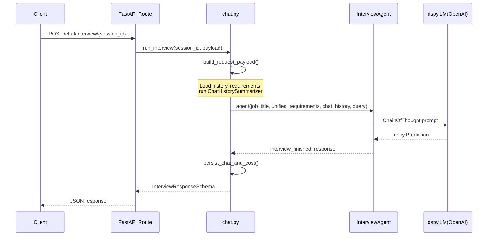
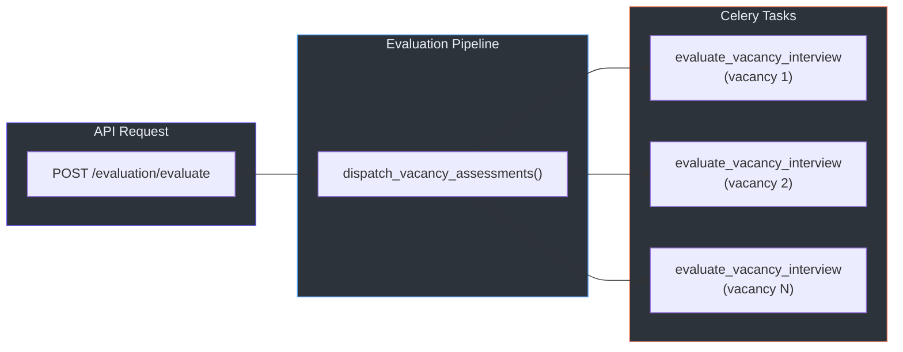
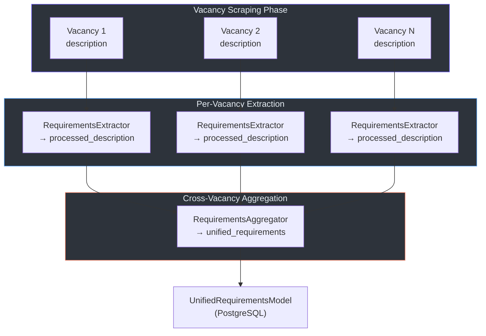

# Agent System

## Overview

The ML Service uses **DSPy** as its agent framework, implementing all LLM-powered reasoning as `dspy.Module` subclasses. Each agent follows a consistent pattern:

1. A **`dspy.Signature`** defines the prompt template with typed input/output fields
2. A **`dspy.Module`** wraps the signature in a `dspy.ChainOfThought` predictor
3. A **`forward()` / `aforward()`** method pair provides sync and async execution

This architecture ensures structured I/O, built-in chain-of-thought reasoning, and runtime model swappability.

## Agent Inventory

| Agent | Location | Input | Output |
|-------|----------|-------|--------|
| `InterviewAgent` | `interview/interview.py` | job_title, unified_requirements, chat_history, query | interview_finished, response |
| `VacancyInterviewAssessmentAgent` | `assessment/assessment.py` | vacancy_description, chat_history | VacancyInterviewAssessmentSchema |
| `ChatHistorySummarizer` | `chat_summarizer/summarizer.py` | messages | summary |
| `RequirementsExtractor` | `requirements_extractor/extractor.py` | vacancy_description | processed_description |
| `RequirementsAggregator` | `requirements_aggregator/aggregator.py` | processed_descriptions (list) | aggregated_requirements |

## Interview Agent

### Purpose

The `InterviewAgent` is the core conversational engine. It acts as a **Hiring Manager** persona, conducting chat-based interviews by selecting the next most relevant question from the unified requirements list.

### Signature Design

The `InterviewSignature` (`interview/schemas.py:37-125`) encodes a sophisticated prompt with:

- **Semantic Deduplication Logic**: Three rules prevent re-asking covered topics:
  1. **Umbrella Rule**: Broad-category coverage doesn't automatically mark sub-items as done
  2. **No-Go Inference**: If a core domain is FAIL, skip all domain-specific tools
  3. **Synonym Matching**: Treat variations as the same topic (e.g., "Client Communication" = "Stakeholder Management")

- **Answer Verification**: Before moving to a new topic, the agent checks whether the user actually answered the previous question

- **Priority Order** for topic selection:
  1. Past Experience
  2. Years of Experience
  3. Language Proficiency
  4. Essential Hard Skills & Specifics
  5. Core Domain Experience

### Input/Output

```python
# Input Fields
job_title: str          # e.g., "Senior Python Developer"
unified_requirements: str  # Consolidated requirements from all vacancies
chat_history: List[BaseMessage]  # LangChain messages
query: str              # Latest user input

# Output Fields
interview_finished: bool  # True when all requirements have been assessed
response: str           # Next question or closing statement
```

### Execution Modes

The agent supports two execution modes:

1. **Synchronous** (`run_interview()` in `pipelines/chat.py:170`):
   - Uses `agent(...)` directly
   - Returns a complete `InterviewResponseSchema`

2. **Streaming** (`stream_interview()` in `pipelines/chat.py:230`):
   - Uses `dspy.streamify()` with `StreamListener` on `response` and `reasoning` fields
   - Yields SSE events: `{"type": "reasoning"}`, `{"type": "answer"}`, `{"type": "complete"}`



## Assessment Agent

### Purpose

The `VacancyInterviewAssessmentAgent` evaluates a candidate's interview performance against a specific vacancy description. It operates as a **Strict Recruitment Compliance Auditor**.

### Whitelist Protocol

The assessment follows a strict **Whitelist Rule** (`assessment.py:22-68`):

1. **Read Vacancy First**: Identify skills explicitly listed in the vacancy
2. **Ignore Out-of-Scope Questions**: If the interviewer asked about "Elasticsearch" but it's not in the vacancy, and the candidate said "I don't know" → **DISCARD** (not a weak side)
3. **Strict Matching**: Strong/weak sides only reference skills that appear in the vacancy text

### Input/Output

```python
# Input Fields
vacancy_description: str        # Full vacancy text
chat_history: List[BaseMessage]  # Complete interview transcript

# Output Fields
assessment: VacancyInterviewAssessmentSchema
    score: float       # 0.0 to 1.0 (Met Skills / Total Skills)
    strong_sides: str   # Skills the candidate demonstrated
    weak_sides: str     # Vacancy skills the candidate lacks
```

### Task Dispatch

Assessments are dispatched as Celery tasks, one per vacancy:



## Chat History Summarizer

### Purpose

The `ChatHistorySummarizer` prevents token overflow in long interviews by compressing older messages into a structured system message.

### Algorithm

The `summarize()` method (`summarizer.py:46-94`) follows this logic:

1. **Threshold Check**: If `len(history) <= max_history_len` (default: 10), return as-is
2. **Split**: Divide history into `to_summarize` (oldest) and `recent_messages` (newest)
3. **QA Alignment**: Ensure the split doesn't break a question-answer pair by moving messages until `to_summarize` ends with a human message
4. **LLM Compression**: Feed `to_summarize` through the `ChatSummarizationSignature`
5. **Reassemble**: Return `[SystemMessage("[PREVIOUS CONTEXT SUMMARY]: ..."), ...recent_messages]`

### Summary Format

The `ChatSummarizationSignature` (`chat_summarizer/schemas.py:8-54`) produces a structured summary with:

- **Interview Metadata**: Language and proficiency
- **Topic Analysis**: Per-topic status (PASS/FAIL/PARTIAL) with claims, assessment, and gaps
- **Unstructured Evidence**: Minor details and tool mentions

This format is specifically designed for the `InterviewAgent`'s prompt, which reads the `[PREVIOUS CONTEXT SUMMARY]` system message to avoid re-asking covered topics.

## Requirements Pipeline Agents

### RequirementsExtractor

Extracts requirements from a single vacancy description. Called during vacancy detail scraping:

```
Vacancy Description → RequirementsExtractor → processed_description (stored in DB)
```

> **Source**: `requirements_extractor/extractor.py` — Maps `vacancy_description` → `processed_description`

### RequirementsAggregator

Consolidates requirements from all vacancies in a search query into a single master list:

```
[processed_description_1, ..., processed_description_N] → RequirementsAggregator → aggregated_requirements
```

**Deduplication Rules** (`aggregator.py:17-22`):
- Combine identical or similar concepts (e.g., "Python 3.8+" → "Python")
- Merge language levels sensibly (e.g., "English B2" + "English C1" → "English (Intermediate to Advanced)")
- Strictly deduplicate without information loss

### End-to-End Requirements Flow



## LLM Configuration

All agents use the same LLM configuration, resolved from environment variables with optional per-request overrides:

| Setting | Environment Variable | Default |
|---------|---------------------|---------|
| Model | `LLM_MODEL` | `openai/gpt-4.1-mini` |
| Temperature | `LLM_TEMPERATURE` | `0.5` |
| Max Tokens | `LLM_MAX_TOKENS` | `16384` |
| API Key | `OPENAI_API_KEY` | — |

> **Per-request overrides**: The `InterviewChatRequestSchema` supports an optional `llm_config_override` field, allowing the frontend to adjust model, temperature, and additional kwargs on a per-turn basis. See [chat.py:55-84](../src/jobs/pipelines/chat.py).
