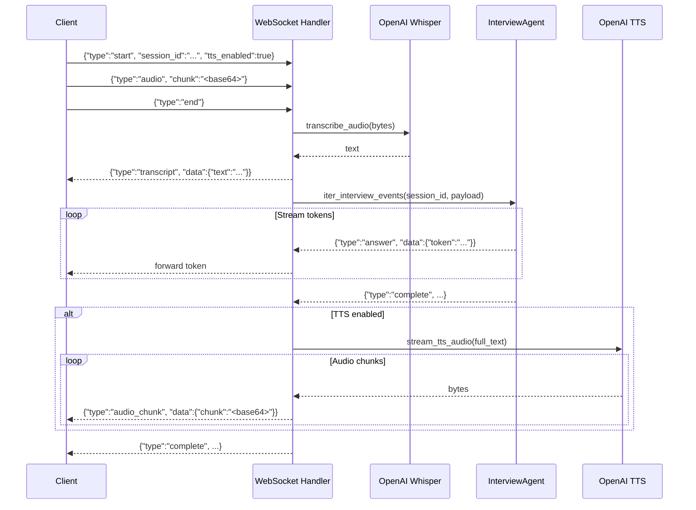

# REST API Reference

## Base URL

All endpoints are mounted under the `/api/v1` prefix:

```
http://localhost:8080/api/v1
```

## Health Check

| Method | Path | Description |
|--------|------|-------------|
| `GET` | `/api/v1/health` | Service health check |

**Response** `200 OK`:
```json
{
  "status": "ok",
  "message": "Service is healthy"
}
```

> **Source**: [main.py](../../src/api/main.py) — defined in the `lifespan` context manager.

---

## Chat Endpoints

### Interview Turn (Sync)

| Method | Path | Description |
|--------|------|-------------|
| `POST` | `/chat/interview/{session_id}` | Run a single interview turn and return the full response |

**Path Parameters**:
| Parameter | Type | Description |
|-----------|------|-------------|
| `session_id` | `str` | Unique session identifier |

**Request Body** — `InterviewChatRequestSchema`:
```json
{
  "search_query_id": 1,
  "query": "I have 5 years of Python experience",
  "llm_config_override": {
    "llm_model": "openai/gpt-4.1",
    "llm_temperature": 0.3,
    "additional_llm_kwargs": {}
  }
}
```

| Field | Type | Required | Description |
|-------|------|----------|-------------|
| `search_query_id` | `int` | ✅ | Links to the scraping search query |
| `query` | `str` | ✅ | User's latest message |
| `llm_config_override` | `object` | ❌ | Optional LLM configuration overrides |

**Response** `200 OK` — `InterviewResponseSchema`:
```json
{
  "interview_finished": false,
  "response": "That's great! Can you tell me about your experience with Django?"
}
```

**Error** `409 Conflict`:
```json
{
  "detail": "Interview already finished for this session."
}
```

> **Source**: [chat.py](../../src/api/routes/chat.py:16-42)

### Interview Turn (Streaming)

| Method | Path | Description |
|--------|------|-------------|
| `POST` | `/chat/interview/{session_id}/stream` | SSE stream of interview response tokens |

Same request body as the sync endpoint. Returns `text/event-stream` with events:

**Token events**:
```json
{"type": "reasoning", "status": "success", "session_id": "abc", "data": {"token": "Let me think..."}}
{"type": "answer", "status": "success", "session_id": "abc", "data": {"token": "Tell me about..."}}
```

**Completion event**:
```json
{"type": "complete", "status": "success", "session_id": "abc", "data": {"interview_finished": false, "response": "Full response text"}}
```

**Error event**:
```json
{"type": "error", "status": "error", "session_id": "abc", "data": {"error": "Internal server error"}}
```

> **Source**: [chat.py](../../src/api/routes/chat.py:45-73)

---

## Chat History Endpoints

### List Sessions

| Method | Path | Description |
|--------|------|-------------|
| `GET` | `/chat-history/sessions` | List all chat sessions (paginated) |

**Query Parameters**:
| Parameter | Type | Default | Description |
|-----------|------|---------|-------------|
| `search_query_id` | `int` | — | Filter by search query |
| `offset` | `int` | `0` | Pagination offset |
| `limit` | `int` | `20` | Page size |

**Response** `200 OK`:
```json
[
  {
    "id": 1,
    "session_id": "session_abc123",
    "search_query_id": 1,
    "title": null,
    "price": 0.0042,
    "interview_finished": true,
    "evaluated": false,
    "created_at": "2026-04-21T10:00:00Z",
    "updated_at": "2026-04-21T10:30:00Z"
  }
]
```

### Get Session Messages

| Method | Path | Description |
|--------|------|-------------|
| `GET` | `/chat-history/sessions/{session_id}/messages` | Retrieve all messages for a session |

**Response** `200 OK`:
```json
[
  {
    "id": 1,
    "session_id": "session_abc123",
    "role": "user",
    "content": "I have 5 years of Python experience",
    "created_at": "2026-04-21T10:00:00Z"
  },
  {
    "id": 2,
    "session_id": "session_abc123",
    "role": "assistant",
    "content": "Great! Can you tell me about your experience with..."
  }
]
```

### Delete Session

| Method | Path | Description |
|--------|------|-------------|
| `DELETE` | `/chat-history/sessions/{session_id}` | Delete a session and all its messages |

**Response** `200 OK`:
```json
{"message": "Session deleted successfully"}
```

> **Source**: [chat_history.py](../../src/api/routes/chat_history.py)

---

## Evaluation Endpoints

### Dispatch Evaluation

| Method | Path | Description |
|--------|------|-------------|
| `POST` | `/evaluation/evaluate` | Dispatch per-vacancy assessment tasks |

**Request Body** — `EvaluationRequestSchema`:
```json
{
  "chat_session_id": "session_abc123",
  "search_query_id": 1
}
```

**Response** `200 OK`:
```json
{
  "chat_session_id": "session_abc123",
  "dispatched_count": 15
}
```

> Dispatches one Celery task per vacancy in the search query. Each task runs the `VacancyInterviewAssessmentAgent` and persists a `VacancyInterviewScoreModel`.

### Get Session Results

| Method | Path | Description |
|--------|------|-------------|
| `GET` | `/evaluation/session/{session_id}/results` | Retrieve assessment scores for a session |

**Response** `200 OK`:
```json
[
  {
    "vacancy_id": 1,
    "score": 0.8,
    "strong_sides": "Strong Python and Django experience...",
    "weak_sides": "No experience with Redis...",
    "search_query_id": 1,
    "chat_session_id": "session_abc123"
  }
]
```

> **Source**: [evaluation.py](../../src/api/routes/evaluation.py)

---

## Scraper Endpoints

### Enqueue Scraping Job

| Method | Path | Description |
|--------|------|-------------|
| `POST` | `/scrapers/scrape` | Start a new vacancy scraping job |

**Request Body** — `ScrapeVacanciesRequestSchema`:
```json
{
  "search_query": "Python Developer"
}
```

**Response** `200 OK` — `ScrapeVacanciesResponseSchema`:
```json
{
  "search_query_id": 1
}
```

> Creates a `SearchQueryModel`, then dispatches the `scrape_vacancies_overview` Celery task.

### Get Scraping Progress

| Method | Path | Description |
|--------|------|-------------|
| `GET` | `/scrapers/progress/{search_query_id}` | Check scraping progress |

**Response** `200 OK` — `ProgressResponseSchema`:
```json
{
  "search_query_id": 1,
  "progress": 0.75,
  "total_results": 20,
  "processed_results": 15
}
```

> **Source**: [scrapers.py](../../src/api/routes/scrapers.py)

---

## Speech Endpoints

### Transcribe Audio (HTTP)

| Method | Path | Description |
|--------|------|-------------|
| `POST` | `/speech/transcribe` | Transcribe an audio file to text |

**Request**: `multipart/form-data`
| Parameter | Type | Description |
|-----------|------|-------------|
| `audio_file` | `file` | Audio file (WAV, MP3, etc.) |
| `language_code` | `str` (optional) | ISO-639 language code |

**Response** `200 OK`:
```json
{
  "text": "I have five years of Python experience"
}
```

### Speech-to-Speech Stream (WebSocket)

| Protocol | Path | Description |
|----------|------|-------------|
| `WebSocket` | `/speech/stream` | Full speech-to-speech interview pipeline |

**Frame Types** (Client → Server):

| Frame Type | Fields | Description |
|-----------|--------|-------------|
| `start` | `session_id`, `search_query_id`, `tts_enabled`, `language_code`, `output_format`, `voice_id`, `model_id`, `speed` | Initialize stream |
| `audio` | `chunk` (base64) | Send audio chunk |
| `end` | — | Signal end of audio input |

**Frame Types** (Server → Client):

| Frame Type | Fields | Description |
|-----------|--------|-------------|
| `transcript` | `text` | Transcribed user speech |
| `reasoning` | `token` | Chain-of-thought token (debug) |
| `answer` | `token` | Response text token |
| `audio_chunk` | `chunk` (base64) | TTS audio chunk |
| `complete` | `response`, `interview_finished` | Final response |
| `error` | `error` | Error message |

**WebSocket Flow**:



> **Source**: [speech.py](../../src/api/routes/speech.py) — `speech_stream` WebSocket handler (lines 66-279)

---

## Request/Response Schemas

All schemas are defined in [schemas.py](../../src/api/schemas.py) using Pydantic `BaseModel`:

| Schema | Purpose |
|--------|---------|
| `InterviewChatRequestSchema` | Interview chat input with optional LLM overrides |
| `InterviewResponseSchema` | Interview agent response |
| `LLMConfigOverrideSchema` | Optional model/temperature overrides |
| `ScrapeVacanciesRequestSchema` | Vacancy scraping request |
| `ScrapeVacanciesResponseSchema` | Returns search_query_id |
| `ProgressResponseSchema` | Scraping progress metrics |
| `EvaluationRequestSchema` | Evaluation dispatch request |
| `VacancyInterviewScoreResponseSchema` | Per-vacancy assessment score |
| `SpeechStartFrameSchema` | WebSocket stream initialization |
| `SpeechAudioFrameSchema` | WebSocket audio chunk |
| `SpeechEndFrameSchema` | WebSocket end-of-audio signal |
