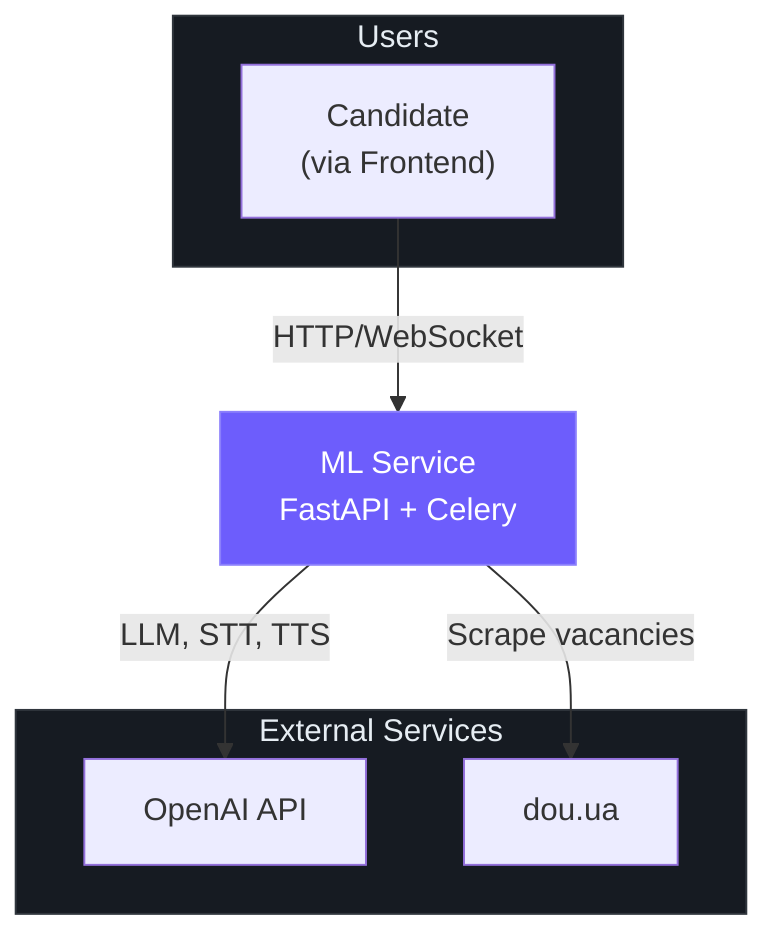
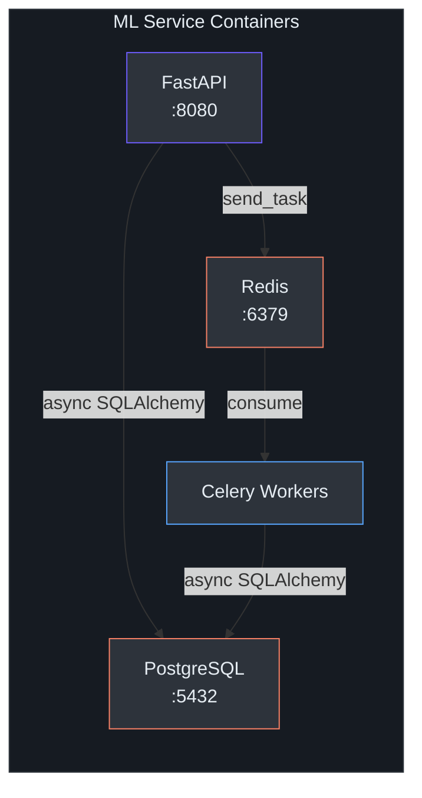
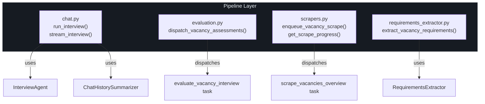
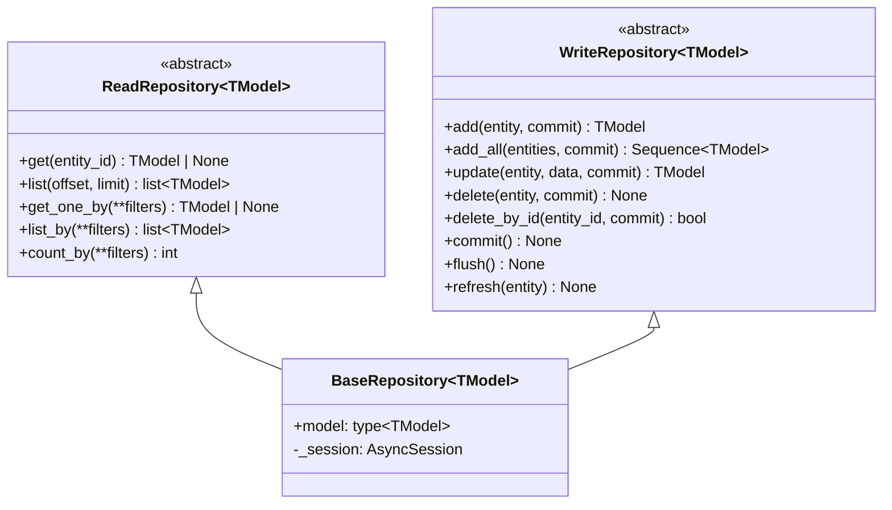

# Architecture Overview

## System Context

The ML Service is the intelligence backend of the Interview Preparation Platform. It operates as a standalone microservice that:

1. **Discovers** job vacancies by scraping external job boards (dou.ua)
2. **Processes** vacancy descriptions to extract and consolidate requirements using LLM pipelines
3. **Conducts** automated technical interviews through text and voice channels
4. **Evaluates** candidate performance against each scraped vacancy

### C4 Context Diagram



## Container Architecture

The ML Service consists of three runtime containers:

| Container | Technology | Responsibility |
|-----------|-----------|----------------|
| **API Server** | FastAPI + Uvicorn | HTTP endpoints, WebSocket speech streaming |
| **Celery Workers** | Celery 5.x | Background scraping, evaluation, requirement unification |
| **Data Stores** | PostgreSQL + Redis | Persistent storage + task queue brokering |



## Component Architecture

### API Layer

The FastAPI application (`src/api/main.py`) mounts five route groups under the `/api/v1` prefix:

| Router | Mount Path | Responsibility |
|--------|-----------|----------------|
| `chat_router` | `/chat` | Interview conversation (sync + SSE streaming) |
| `chat_history_router` | `/chat-history` | Session CRUD, message retrieval |
| `evaluation_router` | `/evaluation` | Assessment dispatch and score retrieval |
| `scraper_router` | `/scrapers` | Vacancy scraping enqueue and progress |
| `speech_router` | `/speech` | Audio transcription (HTTP) + full speech-to-speech (WebSocket) |

> **Source**: [main.py](../src/api/main.py) — `include_router()` calls at lines 34–50.

### Agent Subsystem

All AI reasoning is implemented using **DSPy modules** with `ChainOfThought` predictors. Each agent follows the same pattern:

```
dspy.Signature (prompt template with I/O fields)
    └── dspy.Module (wraps Signature in ChainOfThought)
        └── forward() / aforward() (sync/async execution)
```

| Agent | Module | Purpose |
|-------|--------|---------|
| `InterviewAgent` | `src/agents/implementations/interview/interview.py` | Conducts interviews by selecting the next most relevant question |
| `VacancyInterviewAssessmentAgent` | `src/agents/implementations/assessment/assessment.py` | Evaluates candidate transcript against vacancy requirements |
| `ChatHistorySummarizer` | `src/agents/implementations/chat_summarizer/summarizer.py` | Compresses long histories to reduce token usage |
| `RequirementsExtractor` | `src/agents/implementations/requirements_extractor/extractor.py` | Extracts requirements from individual vacancy descriptions |
| `RequirementsAggregator` | `src/agents/implementations/requirements_aggregator/aggregator.py` | Merges and deduplicates requirements across all vacancies |

> **Design Decision**: DSPy was chosen over raw OpenAI SDK calls because it provides structured I/O via `Signature` classes, built-in chain-of-thought reasoning, streaming support (`dspy.streamify`), and automatic cost tracking.

### Pipeline Layer

Pipelines in `src/jobs/pipelines/` orchestrate the flow between API handlers and agents:



### Data Layer

The data layer uses the **Repository Pattern** with a generic `BaseRepository` providing full CRUD:



> **Source**: [base.py](../src/db/repositories/base.py) — Generic `BaseRepository` with `TModel = TypeVar("TModel", bound=Base)`.

### Conversation History System

The `ConversationHistoryManager` bridges between **LangChain message types** and **SQLAlchemy ORM models**, providing a unified API for:

- Creating/retrieving chat sessions
- Persisting messages with role-based serialization
- Tracking session pricing and interview completion state

```mermaid
graph LR
    subgraph Interface["ConversationHistoryManager"]
        style Interface fill:#2d333b,stroke:#6d5dfc,color:#e6edf3
        API_Layer["API/Pipeline Code"]
    end

    subgraph Bridge["Message Bridge"]
        style Bridge fill:#2d333b,stroke:#58a6ff,color:#e6edf3
        LC["LangChain<br>BaseMessage"]
        Dict["Dict repr<br>{role, content}"]
    end

    subgraph Storage["Persistence"]
        style Storage fill:#2d333b,stroke:#f78166,color:#e6edf3
        Session["ChatSessionModel"]
        Msg["ChatMessageModel"]
    end

    API_Layer -->|save_messages()| LC
    LC -->|serialize| Dict
    Dict -->|ORM insert| Msg
    Msg -->|belongs_to| Session
```

## Key Design Decisions

### 1. DSPy as the Agent Framework

DSPy provides structured prompt engineering through `Signature` classes, which define typed input/output fields. This eliminates ad-hoc prompt string manipulation and enables:

- **Streaming** via `dspy.streamify()` for real-time token delivery
- **Usage tracking** via `dspy.context(track_usage=True)` for cost monitoring
- **Model flexibility** through `dspy.LM()` — the model can be swapped via environment variables

### 2. Celery for Background Processing

Vacancy scraping and evaluation are inherently I/O-bound and long-running. Celery provides:

- **Rate limiting**: `rate_limit="40/m"` on overview scraping, `rate_limit="20/m"` on detail scraping
- **Automatic retries**: `max_retries=3` with configurable delay
- **Task chaining**: Overview scrape automatically enqueues per-vacancy detail scrapes, which in turn trigger requirements unification

### 3. Repository Pattern over Active Record

The codebase uses a clean separation between ORM models and data access logic. The `BaseRepository` provides generic CRUD, while domain-specific repositories add targeted methods (e.g., `count_by_search_query_id`). This enables:

- Easy unit testing via session mocking
- Explicit transaction control (`commit` parameter)
- No business logic leaking into ORM models

### 4. Chat History Summarization

To manage token budgets in long interviews, the `ChatHistorySummarizer` uses a sliding-window approach:

1. If `len(history) > max_history_len` (default: 10), the oldest messages are compressed into a `SystemMessage` summary
2. The summary uses the `[PREVIOUS CONTEXT SUMMARY]` prefix, which the `InterviewAgent`'s prompt is designed to respect
3. This prevents re-asking questions about already-covered topics

### 5. WebSocket Speech Streaming

The speech endpoint (`/api/v1/speech/stream`) implements a full speech-to-speech pipeline:

```
Client Audio → Whisper STT → InterviewAgent (SSE) → OpenAI TTS → Client Audio
```

Audio arrives as base64-encoded chunks in JSON WebSocket frames, enabling real-time voice interviews without page reloads.

## Technology Stack

| Layer | Technology | Version |
|-------|-----------|---------|
| Runtime | Python | `>=3.13, <3.14` |
| Web Framework | FastAPI | `^0.128.0` |
| ASGI Server | Uvicorn | `^0.34.0` |
| ORM | SQLAlchemy (async) | `^2.0.45` |
| Migrations | Alembic | `^1.16.5` |
| Task Queue | Celery + Redis | `^5.6.2` |
| AI Framework | DSPy | `^3.1.2` |
| Message Types | LangChain (core) | `^1.2.7` |
| Scraping | Playwright | `^1.57.0` |
| LLM Provider | OpenAI | `^2.16.0` |
| Logging | Loguru | `^0.7.3` |
| Settings | Pydantic Settings | `^2.12.0` |
| DB Driver | asyncpg (async) / psycopg2 (sync) | Various |
| Dependency Mgmt | Poetry | `>=2.1` |
