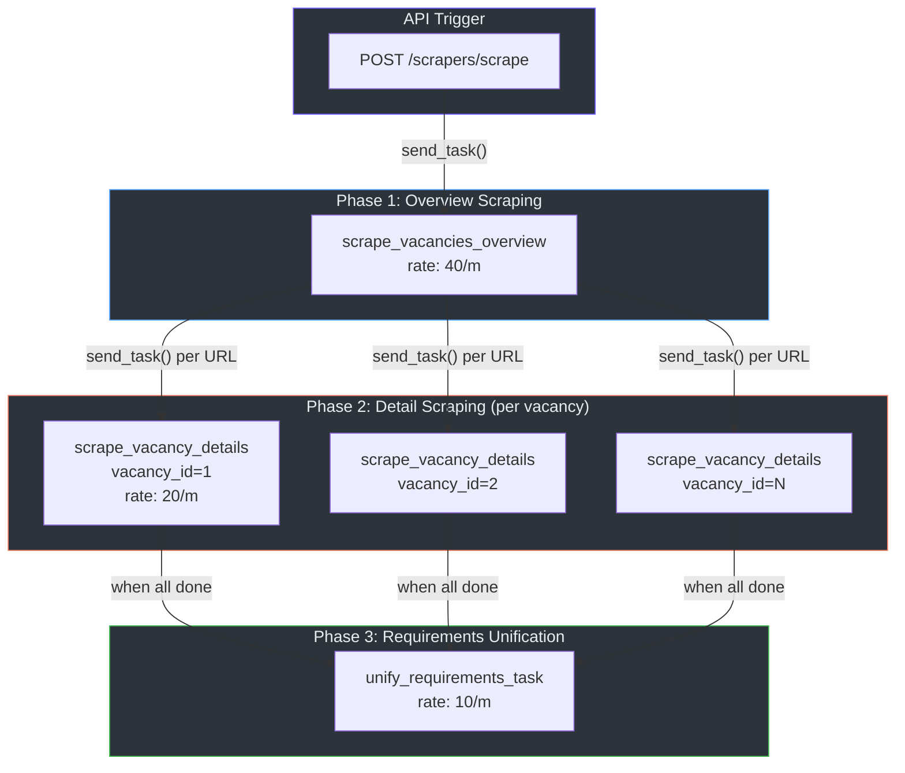
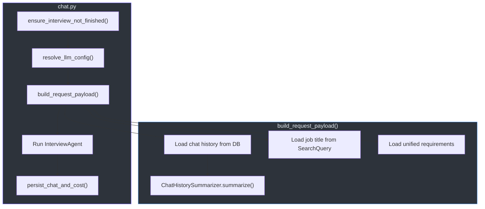

# Celery Tasks & Pipelines

## Overview

The ML Service uses **Celery** with **Redis** as the message broker for long-running or I/O-bound operations. All tasks are defined in `src/jobs/tasks/` and orchestrated by pipelines in `src/jobs/pipelines/`.

## Celery Configuration

**Location**: `src/jobs/celery_app.py`

```python
celery_app = Celery("tasks", broker=redis_config.REDIS_URL)
celery_app.conf.update(
    task_ignore_result=True,      # Discard task return values
    task_acks_late=True,          # Acknowledge after execution (at-least-once delivery)
    worker_concurrency=5,         # 5 concurrent worker threads
    worker_prefetch_multiplier=1, # Fetch 1 task at a time per worker
)
celery_app.autodiscover_tasks(["src.jobs.tasks"])
```

**Starting the worker**:
```bash
celery -A src.jobs.celery_app.celery_app worker -l info
```

## Task Inventory

| Task | Celery Name | Rate Limit | Retries | Delay |
|------|------------|------------|---------|-------|
| `scrape_vacancies_overview` | `scrapers.dou.scrape_vacancies_overview` | `40/m` | 3 | 5s |
| `scrape_vacancy_details` | `scrapers.dou.scrape_vacancy_details` | `20/m` | 3 | 10s |
| `unify_requirements_task` | `agggregation.unify_requirements` | `10/m` | 3 | 10s |
| `evaluate_vacancy_interview` | `assessment.evaluate_vacancy_interview` | — | 3 | 5s |

## Task Pipeline

The tasks form an automated pipeline that chains via `celery_app.send_task()`:



## Task Details

### `scrape_vacancies_overview`

**Location**: `src/jobs/tasks/scrape_dou_vacancies_overview.py`

**Purpose**: Scrapes all vacancy URLs for a given search query from dou.ua.

**Flow**:
1. Initialize `DouScraper` and call `arun(query)` → `VacanciesOverviewSchema`
2. Update `SearchQueryModel.total_results` in the database
3. Create `VacancyModel` records for each discovered URL (with `scrapped=False`)
4. Dispatch `scrape_vacancy_details` for each vacancy ID

**Arguments**:
| Parameter | Type | Description |
|-----------|------|-------------|
| `search_query_id` | `int` | FK to `search_queries` table |
| `query` | `str` | Search term (e.g., "Python Developer") |

### `scrape_vacancy_details`

**Location**: `src/jobs/tasks/scrape_dou_vacancy_details.py`

**Purpose**: Scrapes full details for a single vacancy and extracts requirements.

**Flow**:
1. Retrieve `VacancyModel` from the database by ID
2. Call `DouScraper().scrape_vacancy(url)` to get full details
3. Call `extract_vacancy_requirements(description)` using `RequirementsExtractor` (DSPy)
4. Update the vacancy record with scraped data + `processed_description`
5. Check if **all** vacancies for the search query are processed
6. If complete, dispatch `unify_requirements_task`

**Completion detection** (lines 70-82):
```python
processed_count = await vacancy_repo.count_by_search_query_id(
    vacancy.search_query_id, scrapped=True
)
if processed_count >= search_query.total_results:
    celery_app.send_task(
        name="agggregation.unify_requirements",
        kwargs={"search_query_id": vacancy.search_query_id},
    )
```

### `unify_requirements_task`

**Location**: `src/jobs/tasks/unify_requirements.py`

**Purpose**: Aggregates all processed descriptions into a single unified requirements document.

**Flow**:
1. Fetch all `processed_description` values for the search query
2. Filter out empty descriptions
3. Configure DSPy LM with `temperature=0.0` (strict aggregation)
4. Run `RequirementsAggregator(processed_descriptions=descriptions)`
5. Create or update `UnifiedRequirementsModel` in the database

### `evaluate_vacancy_interview`

**Location**: `src/jobs/tasks/evaluate_vacancy_interview.py`

**Purpose**: Evaluates a candidate's interview transcript against a single vacancy description.

**Flow**:
1. Validate that `vacancy_description` is non-empty
2. Convert `chat_history` dicts to LangChain `BaseMessage` objects
3. Run `VacancyInterviewAssessmentAgent` with DSPy
4. Normalize the assessment score (clamp to 0.0-1.0, round to 1 decimal)
5. Persist `VacancyInterviewScoreModel` to the database

**Score normalization** (`_normalize_score`):
```python
score_value = max(0.0, min(1.0, float(raw_score)))
return round(score_value, 1)
```

## Pipeline Layer

Pipelines in `src/jobs/pipelines/` provide the orchestration logic between API handlers and the task/agent subsystems.

### Chat Pipeline

**Location**: `src/jobs/pipelines/chat.py`

Orchestrates the full interview turn lifecycle:



**Key functions**:

| Function | Purpose |
|----------|---------|
| `ensure_interview_not_finished(session_id)` | Guards against turns on completed interviews (raises `InterviewAlreadyFinishedError`) |
| `resolve_llm_config(payload)` | Merges environment defaults with per-request overrides |
| `build_request_payload(session_id, payload)` | Loads context from DB + summarizes history |
| `run_interview(session_id, payload)` | Synchronous interview turn (returns `InterviewResponseSchema`) |
| `stream_interview(session_id, payload)` | Streaming interview turn (returns SSE `StreamingResponse`) |
| `iter_interview_events(session_id, payload)` | Async generator yielding structured stream events |

### Evaluation Pipeline

**Location**: `src/jobs/pipelines/evaluation.py`

Dispatches one Celery task per vacancy:

```python
async def dispatch_vacancy_assessments(
    chat_session_id: str,
    search_query_id: int,
) -> int:
    # 1. Fetch all vacancies for the search query
    # 2. Load the full chat history
    # 3. For each vacancy with a description:
    #    → celery_app.send_task("assessment.evaluate_vacancy_interview", ...)
    # 4. Return dispatched count
```

### Scrapers Pipeline

**Location**: `src/jobs/pipelines/scrapers.py`

Handles scraping initiation and progress tracking:

| Function | Purpose |
|----------|---------|
| `enqueue_vacancy_scrape(payload)` | Creates `SearchQueryModel`, dispatches overview scrape |
| `get_scrape_progress(search_query_id)` | Calculates progress as `processed / total` |

### Requirements Extractor Pipeline

**Location**: `src/jobs/pipelines/requirements_extractor.py`

A lightweight wrapper that configures DSPy and runs the `RequirementsExtractor`:

```python
def extract_vacancy_requirements(vacancy_description: str) -> str:
    # Configure DSPy LM from openai_config
    # Run RequirementsExtractor
    # Return processed_description
```

## Error Handling

All tasks use Celery's built-in retry mechanism:

```python
@celery_app.task(
    default_retry_delay=5,   # Wait 5 seconds between retries
    max_retries=3,           # Retry up to 3 times
)
```

Pipeline-level errors in streaming (`iter_interview_events`) are caught and forwarded as structured error events:

```json
{"type": "error", "status": "error", "session_id": "...", "data": {"error": "Internal server error"}}
```
