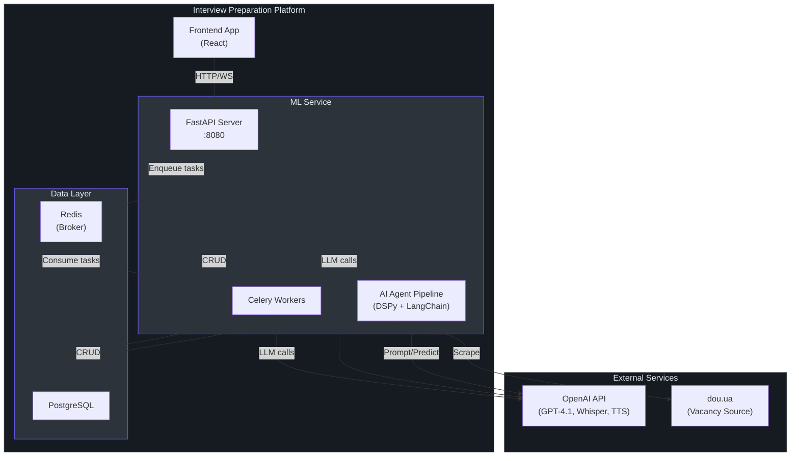
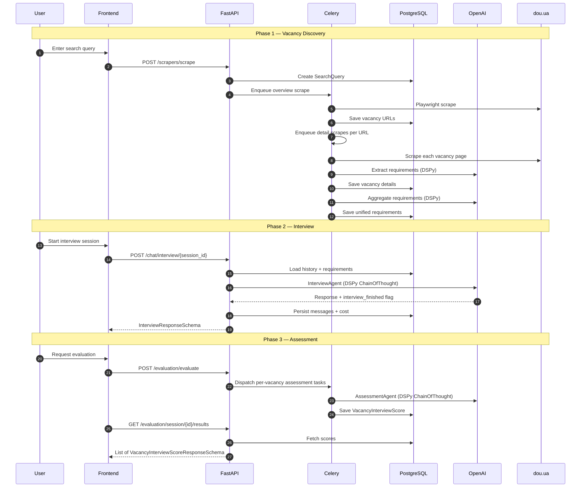

# Onboarding Guide

## Overview

The **Interview Preparation Platform ML Service** is an AI-powered backend that scrapes job vacancies, conducts automated technical interviews via chat or voice, and evaluates candidate performance against real vacancy requirements. This guide takes you from a fresh clone to a fully running local environment.

## Prerequisites

| Tool | Version | Why |
|------|---------|-----|
| Python | `>=3.13, <3.14` | Runtime (`pyproject.toml:32`) |
| Poetry | `>=2.1` | Dependency management (`pyproject.toml:59`) |
| PostgreSQL | `>=14` | Primary data store (`src/config/db.py`) |
| Redis | `>=7` | Celery message broker (`src/config/redis.py`) |
| Playwright | — | Browser automation for scrapers (`src/scrapers/base.py:5`) |
| OpenAI API Key | — | LLM, STT, TTS (`src/config/openai.py:14`) |

## Environment Setup

### 1. Clone & Install Dependencies

```bash
git clone <repository-url>
cd ml

# Install Python dependencies via Poetry
poetry install

# Install Playwright browsers (required for vacancy scraping)
poetry run playwright install chromium
```

### 2. Configure Environment Variables

Copy the example environment file and fill in your values:

```bash
cp example.env .env
```

**Required variables** (see [Configuration Reference](./configuration.md) for the full table):

| Variable | Description | Example |
|----------|-------------|---------|
| `DB_HOST` | PostgreSQL host | `localhost` |
| `DB_PORT` | PostgreSQL port | `5432` |
| `DB_USER` | PostgreSQL username | `postgres` |
| `DB_PASSWORD` | PostgreSQL password | `your_password` |
| `DB_NAME` | PostgreSQL database name | `interview_assistant` |
| `OPENAI_API_KEY` | OpenAI API key | `sk-proj-...` |
| `REDIS_HOST` | Redis host | `localhost` |
| `REDIS_PORT` | Redis port | `6379` |

### 3. Database Setup

```bash
# Create the database
createdb interview_assistant

# Run Alembic migrations
poetry run alembic upgrade head
```

### 4. Start Services

You need **three** processes running simultaneously:

```bash
# Terminal 1: FastAPI server
poetry run bash scripts/run_api.sh
# → Runs: python -m src.api.main
# → Server starts at http://localhost:8080

# Terminal 2: Celery worker (background jobs)
poetry run bash scripts/run_celery.sh
# → Runs: celery -A src.jobs.celery_app.celery_app worker -l info

# Terminal 3: Redis (if not already running)
redis-server
```

### 5. Verify Health

```bash
curl http://localhost:8080/api/v1/health
# Expected: {"status":"ok","message":"Service is healthy"}
```

## First-Run Checklist

- [ ] PostgreSQL is running and database `interview_assistant` exists
- [ ] `poetry install` completed without errors
- [ ] `.env` file is configured with valid `OPENAI_API_KEY` and database credentials
- [ ] `alembic upgrade head` applied all migrations
- [ ] `playwright install chromium` installed browser binaries
- [ ] FastAPI server responds to `/health` endpoint
- [ ] Celery worker is connected to Redis and consuming tasks
- [ ] Redis is running on configured host/port

## System Architecture



## Core Data Flow



## Project Structure Overview

```
ml/
├── src/
│   ├── agents/implementations/     # DSPy AI agents
│   │   ├── interview/              # Interview conductor agent
│   │   ├── assessment/             # Vacancy-interview evaluator
│   │   ├── chat_summarizer/        # History compression
│   │   ├── requirements_extractor/ # Per-vacancy requirements
│   │   └── requirements_aggregator/# Cross-vacancy consolidation
│   ├── api/                        # FastAPI application
│   │   ├── main.py                 # App entry point
│   │   ├── routes/                 # HTTP/WS endpoint handlers
│   │   └── schemas.py              # Pydantic request/response models
│   ├── config/                     # Pydantic Settings classes
│   ├── conversation_history/       # Chat history management (LangChain)
│   ├── core/                       # Logging configuration
│   ├── db/                         # SQLAlchemy ORM layer
│   │   ├── models/                 # Table definitions
│   │   ├── repositories/           # Repository pattern CRUD
│   │   ├── engine.py               # Async engine + session factory
│   │   └── migrations/             # Alembic migration scripts
│   ├── jobs/                       # Celery background tasks
│   │   ├── celery_app.py           # Celery broker configuration
│   │   ├── tasks/                  # Individual task definitions
│   │   └── pipelines/              # Orchestration logic
│   ├── scrapers/                   # Playwright-based web scrapers
│   │   ├── base.py                 # Abstract scraper interface
│   │   ├── implementations/        # Site-specific scrapers
│   │   └── schemas/                # Scraper data schemas
│   ├── services/                   # External service integrations
│   └── tools/                      # Agent tool implementations
├── scripts/                        # Shell scripts for running services
├── tests/                          # Test suite
├── pyproject.toml                  # Poetry project configuration
├── alembic.ini                     # Alembic migration configuration
├── Dockerfile                      # Container build definition
└── .pre-commit-config.yaml         # Code quality hooks
```

## Next Steps

| Topic | Documentation |
|-------|--------------|
| Full system architecture | [Architecture Overview](./architecture_overview.md) |
| AI agent deep-dive | [Agent System](./agents/agent_system.md) |
| API reference | [REST Endpoints](./api/rest_endpoints.md) |
| Background jobs | [Celery Tasks](./jobs/celery_tasks.md) |
| Database schema | [Data Model](./database/data_model.md) |
| All configuration | [Configuration Reference](./configuration.md) |
