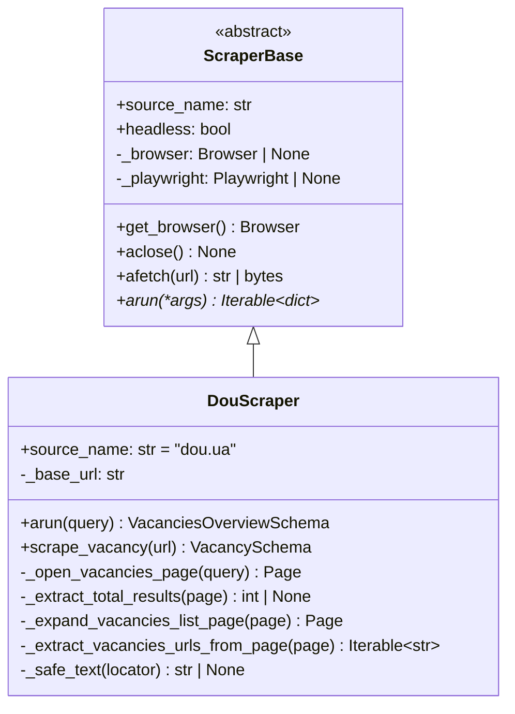
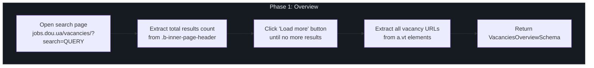
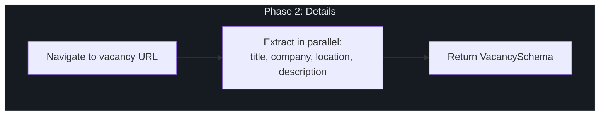

# Scrapers

## Overview

The scraper subsystem uses **Playwright** (headless Chromium) to extract job vacancy listings from dou.ua, the largest Ukrainian IT job board. The system is designed with a pluggable architecture: a base `ScraperBase` class defines the interface, and concrete implementations handle site-specific behavior.

## Architecture



## ScraperBase

**Location**: `src/scrapers/base.py`

The abstract base class provides:

| Method | Description |
|--------|-------------|
| `get_browser()` | Lazily initializes a Playwright Chromium browser instance |
| `aclose()` | Closes the browser and stops Playwright |
| `afetch(url)` | Opens a page, navigates to URL, and returns raw HTML |
| `arun(*args)` | **Abstract** — executes the full scraping pipeline |
| `run(*args)` | Sync wrapper via `asyncio.run()` |

The base class inherits from both `BaseModel` (Pydantic) and `ABC`, allowing scrapers to be configured via Pydantic fields while enforcing the scraper interface.

## DouScraper

**Location**: `src/scrapers/implementations/dou.py`

### Two-Phase Scraping

The dou.ua scraper operates in two distinct phases:

#### Phase 1: Overview Scrape

Collects all vacancy **URLs** for a search query.



**Key implementation details**:

- **Load More expansion** (`_expand_vacancies_list_page`): Uses jQuery-style trigger simulation (`mousedown` → `mouseup` → `click`) because dou.ua uses Ajax pagination
- **Total results extraction** (`_extract_total_results`): Parses the page header with regex to find the vacancy count
- **Safe text extraction** (`_safe_text`): Catches all exceptions and normalizes whitespace with `re.sub(r'\s+', ' ', text)`

#### Phase 2: Detail Scrape

Extracts full details from each individual vacancy page.



**Performance optimization**: The `scrape_vacancy()` method uses `asyncio.gather()` to extract title, company, location, and description in parallel.

## Data Schemas

**Location**: `src/scrapers/schemas/vacancy.py`

### VacancySchema

Represents a single scraped vacancy:

```python
class VacancySchema(BaseModel):
    title: str         # Vacancy title
    company: str       # Company name
    location: str | None  # Location (may be remote)
    description: str   # Full vacancy description
    url: str           # Source URL

    model_config = ConfigDict(from_attributes=True)  # ORM compatibility
```

### VacanciesOverviewSchema

Represents the overview scrape result:

```python
class VacanciesOverviewSchema(BaseModel):
    query: str              # Original search query
    total_results: int      # Total vacancies found
    vacancies_urls: List[str]  # Extracted URLs
```

## Integration with Celery

The scrapers are invoked exclusively through Celery tasks:

| Task | Queue | Rate Limit | Retries |
|------|-------|------------|---------|
| `scrape_vacancies_overview` | `scrapers` | `40/m` | 3 |
| `scrape_vacancy_details` | `scrapers` | `20/m` | 3 |

**Task chaining**: Overview → per-vacancy detail scrapes → (when all done) → requirements unification.

See [Celery Tasks](../jobs/celery_tasks.md) for the full task pipeline documentation.

## Adding a New Scraper

To add support for a new job board:

1. Create a new file in `src/scrapers/implementations/`
2. Extend `ScraperBase` and implement `arun()`
3. Add corresponding Celery tasks in `src/jobs/tasks/`
4. Register the tasks in `src/jobs/tasks/__init__.py`

```python
from src.scrapers.base import ScraperBase

class NewBoardScraper(ScraperBase):
    source_name: str = "newboard.com"

    async def arun(self, query: str) -> VacanciesOverviewSchema:
        # Implement scraping logic here
        ...
```
